Generation of data cube mosaics
===============================

The code described below for mosaic generation relies on the use of the
**reproject** `package <https://reproject.readthedocs.io/en/stable/>`_, which
implements image reprojection methods for astronomical images.

The image combination assumes that the individual exposures to be combined are
provided in flux units (e.g., ADU/s or something proportional).

In this section, we’ll use auxiliary images that we’ll generate beforehand with
the help of ``fridadrp-ifu_simulator``.

.. warning::

   Please note that the code shown below is under development and may undergo
   modifications.

Combination of 2D images
------------------------

Before tackling the combination of 3D data cubes, let's see how the **numina**
package facilitates the combination of 2D FITS images.

Generation of individual exposures
..................................

For this example we are using the files :download:`scene_m51_2d.yaml
<mosaics/scene_m51_2d.yaml>` and :download:`m51_dss1.fits
<mosaics/m51_dss1.fits>`.

Execute ``fridadrp-ifu_simulator`` to generate the images to be combined:

.. code-block:: console

   (venv_frida) $ fridadrp-ifu_simulator \
     --scene scene_m51_2d.yaml \
     --grating medium-K \
     --scale coarse \
     --delta_ra_teles_arcsec 0.0 \
     --delta_dec_teles_arcsec 0.0 \
     --instrument_pa_deg 0.0 \
     --flatpix2pix none \
     --stop_after_ifu_3D_method0 \
     --prefix_intermediate_FITS test0a \
     --seed 1234

.. code-block:: console

   (venv_frida) $ fridadrp-ifu_simulator \
     --scene scene_m51_2d.yaml \
     --grating medium-K \
     --scale fine \
     --delta_ra_teles_arcsec -0.1 \
     --delta_dec_teles_arcsec -0.2 \
     --instrument_pa_deg 40.0 \
     --flatpix2pix none \
     --stop_after_ifu_3D_method0 \
     --prefix_intermediate_FITS test0b \
     --seed 2345

.. code-block:: console

   (venv_frida) $ fridadrp-ifu_simulator \
     --scene scene_m51_2d.yaml \
     --grating medium-K \
     --scale fine \
     --delta_ra_teles_arcsec 0.2 \
     --delta_dec_teles_arcsec 0.2 \
     --instrument_pa_deg 20.0 \
     --flatpix2pix none \
     --stop_after_ifu_3D_method0 \
     --prefix_intermediate_FITS test0c \
     --seed 3456

We have used the parameter ``--stop_after_ifu_3D_method0`` because we do not
need to execute all the steps of the simulator to generate the images we will
need in this case. Note that the first execution uses ``--scale coarse``, while the
next two use ``--scale fine``. Additionally, the values of
``--delta_ra_teles_arcsec``, ``--delta_dec_teles_arcsec``, and
``--instrument_pa_deg`` are different. However, since the airmass value is not
specified, it is assumed to be 1.0 in the three cases.

The files ``test0?_ifu_white2D_method0_os1.fits`` (with ``?`` equal to a, b or
c) can be examined with any visualization tool. The **numina** package provides
the auxiliary script ``numina-ximshow`` for this purpose

.. code-block:: console

   (venv_frida) $ numina-ximshow \
   test0?_ifu_white2D_method0_os1.fits \
   --cmap viridis \
   --cbar_orientation vertical \
   --aspect equal \
   --z1z2 minmax

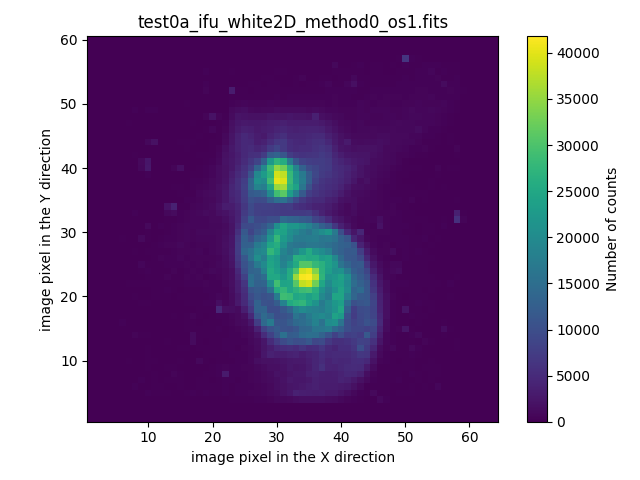
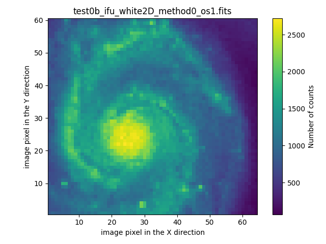
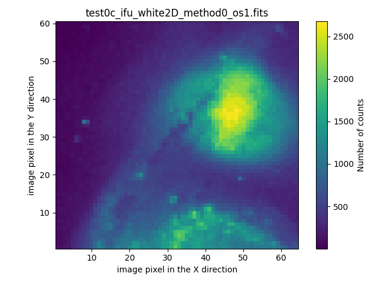

Note that it is also possible to visualize the collapsed view of the
corresponding 3D data cubes, using in this case the **numina** script
``numina-extract_2d_slice_from_3d_cube`` (if no parameters are specified, it is
assumed that the collapse is performed along NAXIS3 and all pixels in that
direction are summed):

.. code-block:: console

   (venv_frida) $ numina-extract_2d_slice_from_3d_cube test0a_ifu_3D_method0.fits
   (venv_frida) $ numina-extract_2d_slice_from_3d_cube test0b_ifu_3D_method0.fits
   (venv_frida) $ numina-extract_2d_slice_from_3d_cube test0c_ifu_3D_method0.fits

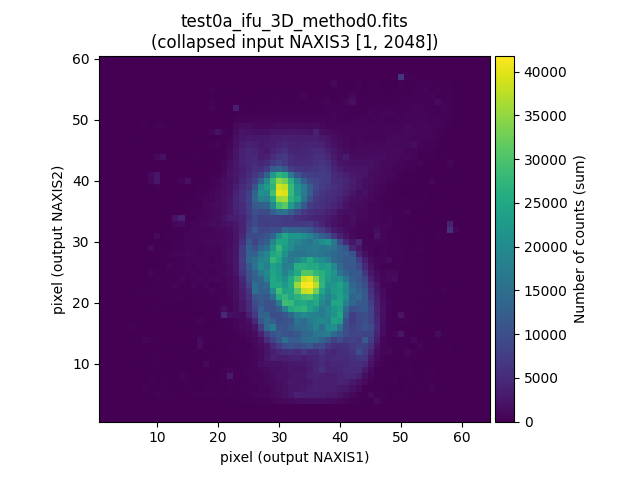
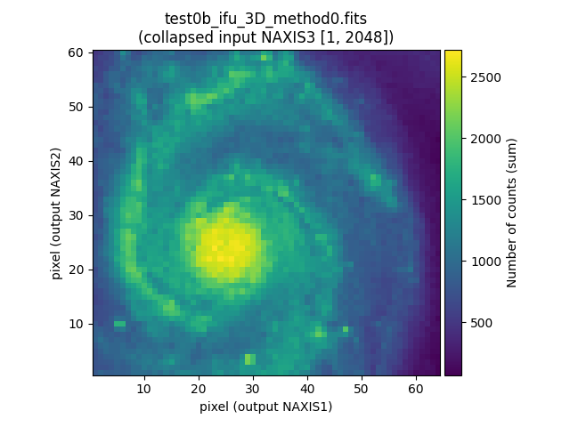
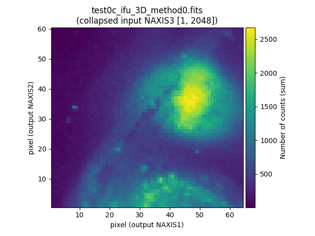

Combination of individual exposures
...................................

The combination of the images is carried out using the **numina** script
``numina-generate_mosaic_of_2d_images``, which takes as input an ASCII file
containing the list of 2D FITS images to be combined, and the name of the
output file.

The first step is then to generate an auxiliary text file with the names of the
2D FITS images to be combined.

.. code-block:: console

   (venv_frida) $ ls test0?_ifu_white2D_method0_os1.fits > list0_2d_images.txt
   (venv_frida) $ cat list0_2d_images.txt

.. code-block::
   :class: my-special-block no-copybutton

   test0a_ifu_white2D_method0_os1.fits
   test0b_ifu_white2D_method0_os1.fits
   test0c_ifu_white2D_method0_os1.fits

To combine the 3 selected images, we only need to execute the **numina**
script ``numina-generate_mosaic_of_2d_images``:

.. code-block:: console

   (venv_frida) $ numina-generate_mosaic_of_2d_images \
     list0_2d_images.txt \
     combination_test0_2d.fits \
     --verbose

.. literalinclude:: mosaics/execution_combination_test0_2d.txt
   :class: my-special-block no-copybutton

Next, we compare the result of the combination of the 3 simulated exposures 
with the first exposure alone: both
cover the field of the *coarse* camera. The improvement in spatial resolution
in the combined image is noticeable after including the two pointings made with
the *fine* camera.  Note that the combined image has the sampling corresponding
to the *fine* camera. Hence, the number of counts shows such a different value
in both images.

.. code-block:: console

   (venv_frida) $ numina-ximshow \
     combination_test0_2d.fits test0a_ifu_white2D_method0_os1.fits \
     --cmap viridis \
     --cbar_orientation vertical \
     --aspect equal \
     --z1z2 minmax

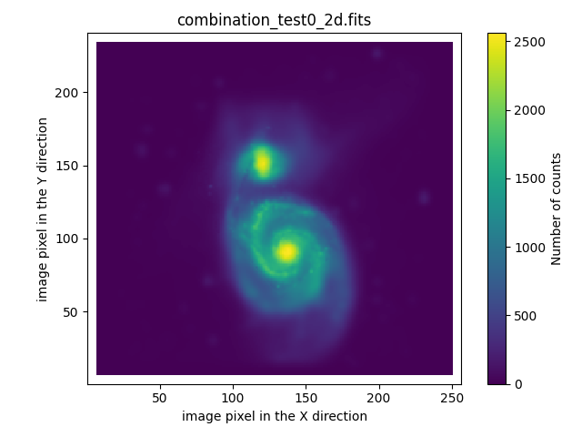
.. image:: mosaics/single_test0a_2d.png
   :width: 49%

The following figure shows the result of combining the two exposures obtained
with the 'fine' camera, represented on top of the first exposure calculated
with an oversampling of 10 (file ``testa_ifu_white2D_method0_os10.fits``).

.. image:: mosaics/combined_with_bw_background.png
   :align: center
   :width: 70%

Combination of 3D data cubes: example 1
---------------------------------------

We can start by combining the three 3D cubes generated in the previous section.
Let us recall that in this case, the three cubes cover different solid angles
on the celestial sphere but span the same wavelength range. Likewise, we do not
have issues with differential atmospheric refraction within each data cube
because we have assumed an airmass of 1.0.

The combination of the images is carried out using the **numina** script
``numina-generate_mosaic_of_3d_cubes``, which takes as input an ASCII file
containing the list of 3D FITS images to be combined, and the name of the
output file.

.. code-block:: console

   (venv_frida) $ ls test0?_ifu_3D_method0.fits > list0_3d_cubes.txt

.. code-block:: console

   (venv_frida) $ cat list0_3d_cubes.txt 

.. code-block::
   :class: my-special-block no-copybutton

   test0a_ifu_3D_method0.fits
   test0b_ifu_3D_method0.fits
   test0c_ifu_3D_method0.fits

.. code-block:: console

   (venv_frida) $ numina-generate_mosaic_of_3d_cubes \ 
    list0_3d_cubes.txt \
    all0_3d.fits \
    --reproject_method adaptive \
    --footprint \
    --verbose

.. literalinclude:: mosaics/execution_combination_test0_3d.txt
   :class: my-special-block no-copybutton

We can visualize the result using ``ds9``:

.. code-block:: console

   (venv_frida) $ ds9 \
     -scale mode minmax \
     -geometry 1000x1000 \
     -wcs degrees \
     -multiframe \
     test0a_ifu_3D_method0.fits \
     test0b_ifu_3D_method0.fits \
     test0c_ifu_3D_method0.fits \
     all0_3d.fits \
     -lock slice image \
     -lock frame image \
     -zoom to fit \
     -cmap viridis \
     -match frame colorbar \
     -match frame wcs \
     -colorbar lock yes \
     -view multi yes

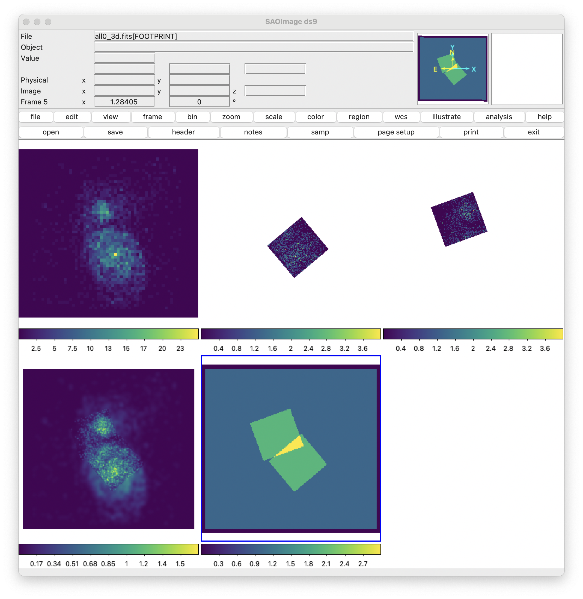

In the first row, the three individual exposures are shown. In the bottom row,
the image on the left corresponds to the combination of the three individual
exposures, while the image in the center is the footprint of that combination.

Combination of 3D data cubes: example 2
---------------------------------------

In this case, we will introduce the effect of differential atmospheric
refraction, using exposures of the same region of the sky but with different
airmasses and position angles.

Generation of individual exposures
..................................

For this example we are using the file :download:`scene_m51_3d.yaml
<mosaics/scene_m51_3d.yaml>`.

Execute ``fridadrp-ifu_simulator``:

.. code-block:: console

   (venv_frida) $ fridadrp-ifu_simulator \
     --scene scene_m51_3d.yaml \
     --grating medium-K \
     --scale fine \
     --airmass 1.0 \
     --parallactic_angle_deg 0 \
     --instrument_pa_deg 0 \
     --stop_after_ifu_3D_method0 \
     --prefix_intermediate_FITS test1a \
     --seed 1234
     
.. code-block:: console

   (venv_frida) $ fridadrp-ifu_simulator \
     --scene scene_m51_3d.yaml \
     --grating medium-K \
     --scale fine \
     --airmass 3.0 \
     --parallactic_angle_deg 45 \
     --instrument_pa_deg 20 \
     --stop_after_ifu_3D_method0 \
     --prefix_intermediate_FITS test1b \
     --seed 2345

.. code-block:: console

   (venv_frida) $ fridadrp-ifu_simulator \
     --scene scene_m51_3d.yaml \
     --grating medium-K \
     --scale fine \
     --airmass 3.0 \
     --parallactic_angle_deg -45 \
     --instrument_pa_deg 340 \
     --stop_after_ifu_3D_method0 \
     --prefix_intermediate_FITS test1c \
     --seed 3456

We have used again the parameter ``--stop_after_ifu_3D_method0`` because we do
not need to execute all the steps of the simulator to generate the images we
will need in this example. In all cases, we are using the *fine* camera.  In
the first exposure, the airmass is 1.0. In the next two exposures we have
chosen a high airmass to exaggerate the effect of atmospheric refraction,
modifying both the value of the parallactic angle and the instrument.

Examining the individual data cubes before combining them
.........................................................

We can quickly visualize the result with the help of the ``ds9`` program.

.. code-block:: console

   (venv_frida) $ ds9 \
   -scale mode minmax \
   -geometry 1000x1000 \
   -wcs degrees \
   -multiframe \
   test1a_ifu_3D_method0.fits \
   test1b_ifu_3D_method0.fits \
   test1c_ifu_3D_method0.fits \
   -lock slice image \
   -lock frame image \
   -zoom to fit \
   -cmap viridis \
   -match frame colorbar \
   -colorbar lock yes \
   -view multi yes

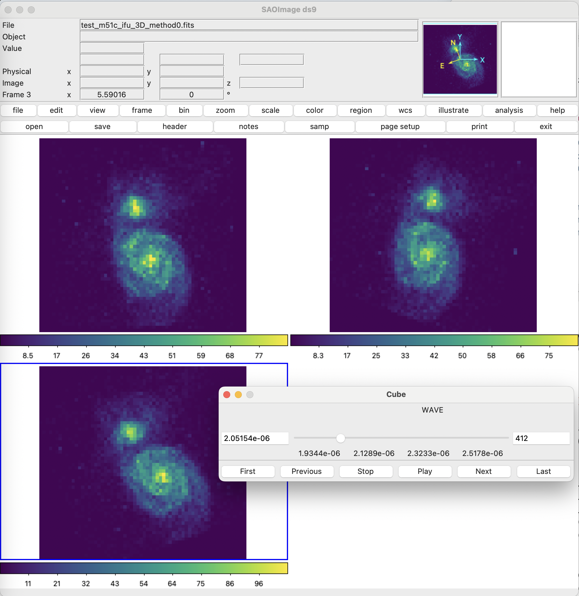

It is also possible to use ``qfitsview`` to visualize simultaneously the
individual exposures. In this case, with the idea of being able to change the
slice in the spectral direction simultaneously in the three exposures, we will
first generate an auxiliary image that performs a stack of the HDUs (header and
data units) from different FITS files into a single FITS file. For that
purpose, we can employ the **numina** script ``numina-stack_hdus``.

.. code-block:: console

   (venv_frida) $ fitsinfo test1*3D*.fits

.. code-block::
   :class: my-special-block no-copybutton

   Filename: test1a_ifu_3D_method0.fits
   No.    Name      Ver    Type      Cards   Dimensions   Format
     0  PRIMARY       1 PrimaryHDU      82   (64, 60, 2048)   int16 (rescales to uint16)   
   
   Filename: test1b_ifu_3D_method0.fits
   No.    Name      Ver    Type      Cards   Dimensions   Format
     0  PRIMARY       1 PrimaryHDU      84   (64, 60, 2048)   int16 (rescales to uint16)   
   
   Filename: test1c_ifu_3D_method0.fits
   No.    Name      Ver    Type      Cards   Dimensions   Format
     0  PRIMARY       1 PrimaryHDU      84   (64, 60, 2048)   int16 (rescales to uint16)   

.. code-block:: console

   (venv_frida) $ ls test1*3D*.fits > list1_3d_cubes.txt

.. code-block:: console

   (venv_frida) $ cat list1_3d_cubes.txt

.. code-block::
   :class: my-special-block no-copybutton

   test1a_ifu_3D_method0.fits
   test1b_ifu_3D_method0.fits
   test1c_ifu_3D_method0.fits

.. code-block:: console

   (venv_frida) $ numina-stack_hdus list1_3d_cubes.txt stack1_3d.fits

.. code-block:: console

   (venv_frida) $ qfitsview stack1_3d.fits

After executing the last command, select 'Read All' when ``qfitsview`` asks for
the extension to read.

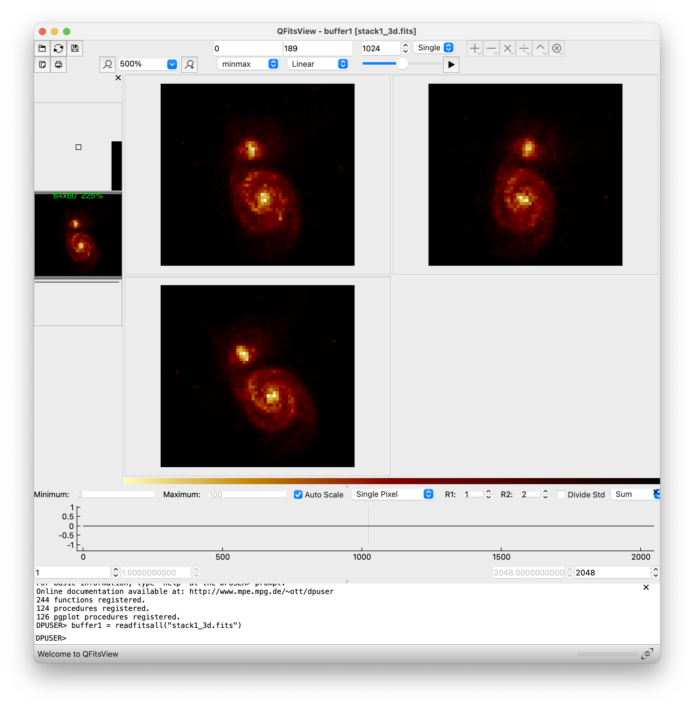

If we collapse the data cubes along the spectral direction (NAXIS3), the effect
of atmospheric refraction is clearly noticeable.

.. code-block:: console

   (venv_frida) $ numina-extract_2d_slice_from_3d_cube test1a_ifu_3D_method0.fits
   (venv_frida) $ numina-extract_2d_slice_from_3d_cube test1b_ifu_3D_method0.fits
   (venv_frida) $ numina-extract_2d_slice_from_3d_cube test1c_ifu_3D_method0.fits

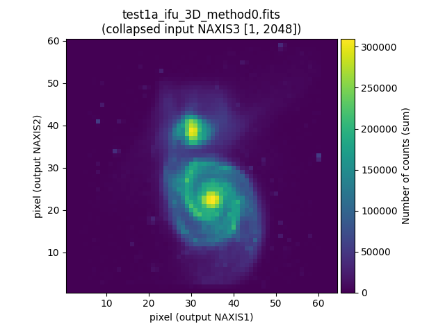
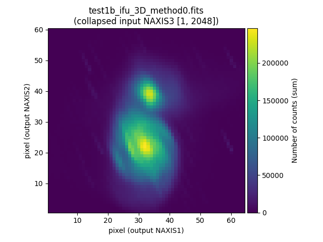
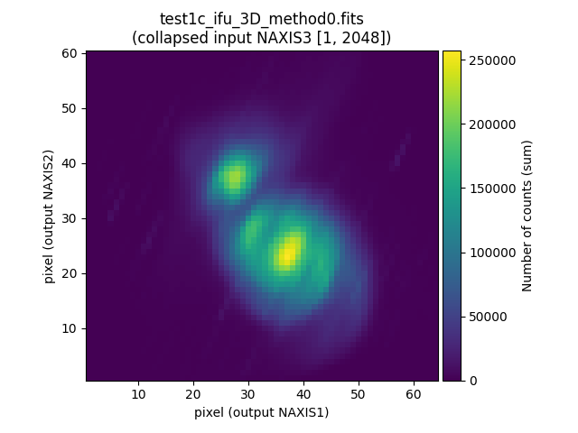

Combination of individual data cubes
....................................

If we combine the previous 3 data cubes ignoring the problem of atmospheric
refraction, the result is not satisfactory.

.. code-block:: console

   (venv_frida) $ numina-generate_mosaic_of_3d_cubes \
     list1_3d_cubes.txt \
     combination_test1_3d.fits \
     --footprint \
     --verbose

.. literalinclude:: mosaics/execution_combination_test1_3d.txt
   :class: my-special-block no-copybutton

.. code-block:: console

   (venv_frida) $ fitsinfo combination_test1_3d.fits

.. code-block:: console
   :class: my-special-block no-copybutton

   Filename: combination_test1_3d.fits
   No.    Name      Ver    Type      Cards   Dimensions   Format
     0  PRIMARY       1 PrimaryHDU      50   (81, 78, 2048)   float32   
     1  FOOTPRINT     1 ImageHDU        29   (81, 78, 2048)   uint8 

.. code-block:: console

   (venv_frida) $ qfitsview combination_test1_3d.fits

The initial spatial cut shown by qfitsview corresponds to pixel 1024 along
NAXIS3. The corresponding image looks apparently normal.

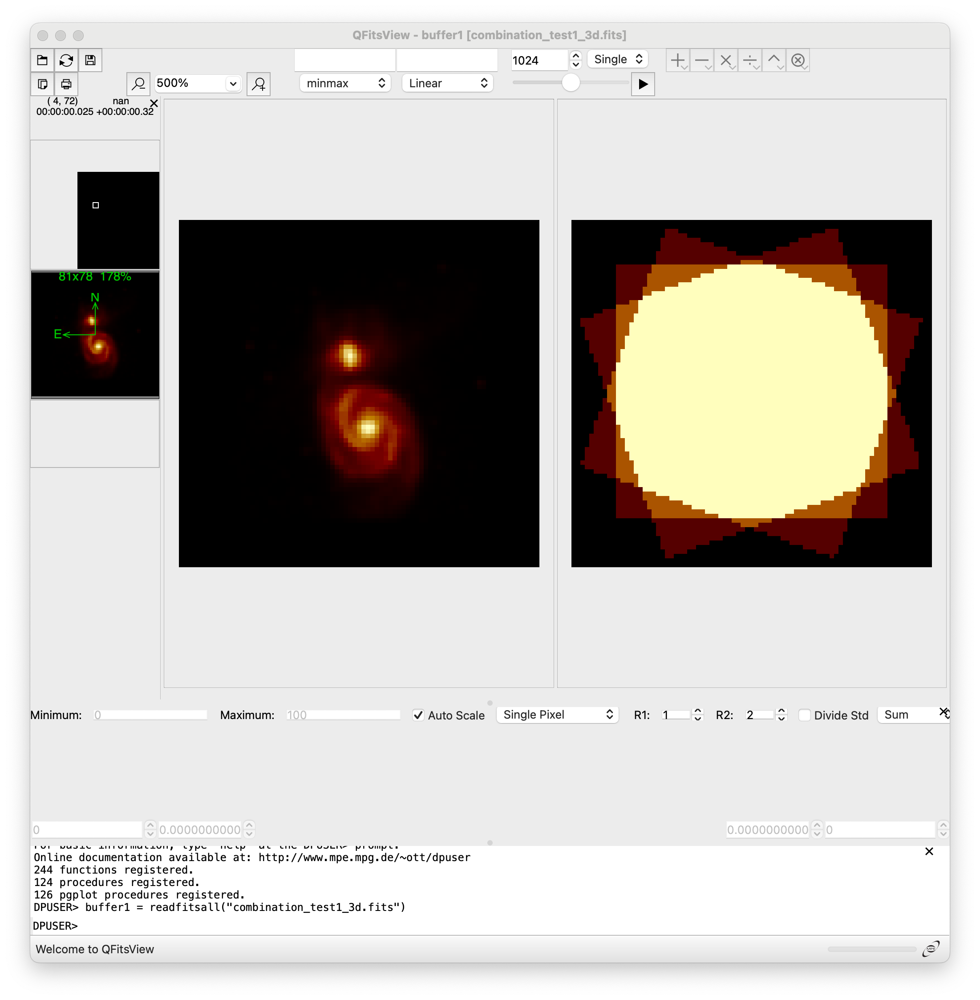

However, when we display the cut corresponding to pixel 1 or pixel 2048, the result is clearly not satisfactory.

.. image:: mosaics/combined_test1_3d_0001.png
   :width: 49%
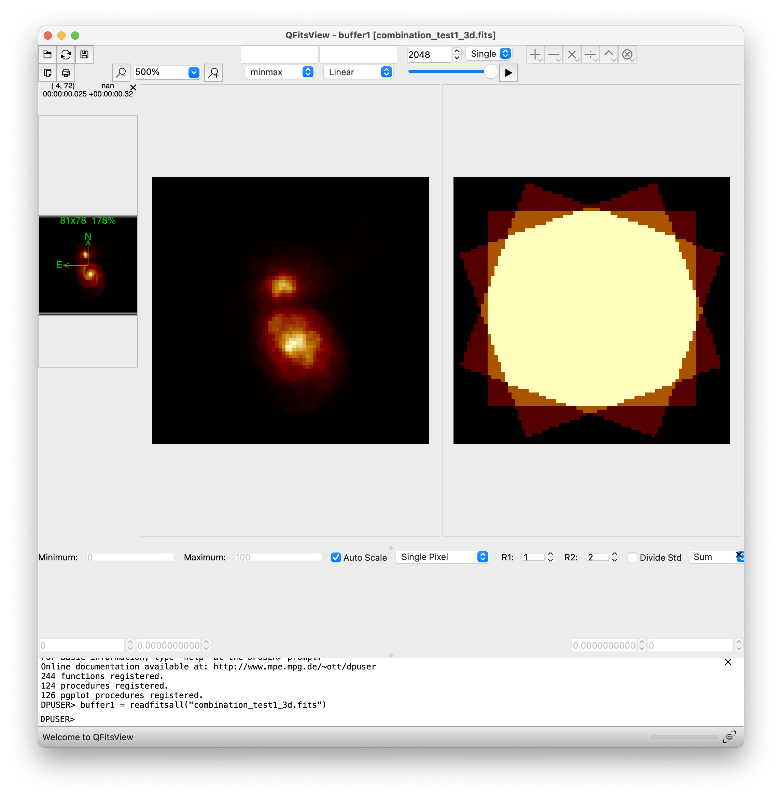

Differencial atmospheric refraction correction
..............................................

It is advisable to correct the individual exposures for differential
atmospheric refraction (taking as reference the position of the image at the
central wavelength along NAXIS3). To do this, we will start by using an
auxiliary script that helps us visualize how significant the effect is in the
images we are working with.

.. code-block:: console

   (venv_frida) $ numina-compute_adr_wavelength \
      --airmass 3 \
      --reference_wave_vacuum 1.7 \
      --wave_ini 1.0 \
      --wave_end 2.5 \
      --wave_step 0.1 \
      --wave_unit micron \
      --plots

.. literalinclude:: mosaics/execution_compute_adr_wavelength_airmass3.txt
   :class: my-special-block no-copybutton

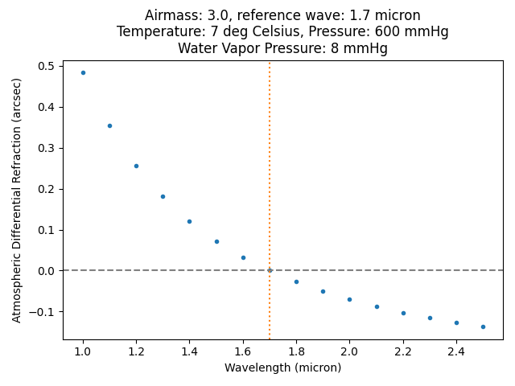

When correcting each individual exposure, we will first insert an extension
with a binary table that stores the effect of atmospheric refraction into each
FITS file.

.. code-block:: console

   (venv_frida) $ fitsheader -k airmass test1?_ifu_3D_method0.fits -f

.. code-block:: console
   :class: my-special-block no-copybutton

            filename          AIRMASS
   -------------------------- -------
   test1a_ifu_3D_method0.fits     1.0
   test1b_ifu_3D_method0.fits     3.0
   test1c_ifu_3D_method0.fits     3.0

Only the second and third images need to be corrected. The first one was obtained with an airmass of 1.0.

.. code-block:: console

   (venv_frida) $ numina-include_adrtheor_in_3d_cube \
     test1b_ifu_3D_method0.fits \
     --verbose --plots

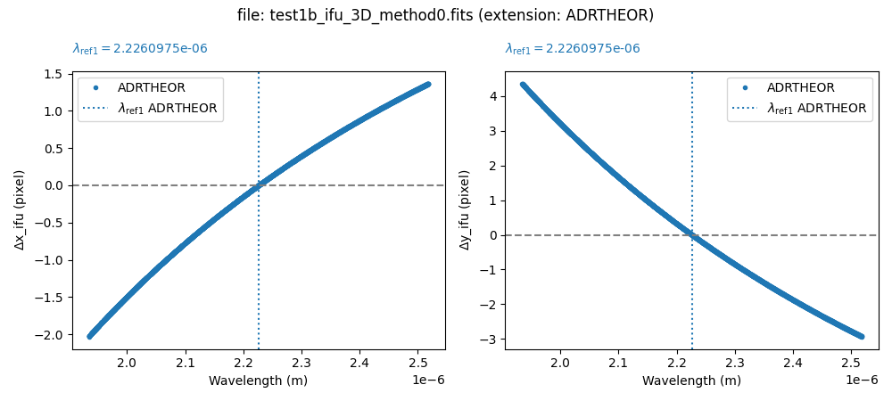

.. code-block:: console

   (venv_frida) $ numina-include_adrtheor_in_3d_cube \
     test1c_ifu_3D_method0.fits \
     --verbose --plots

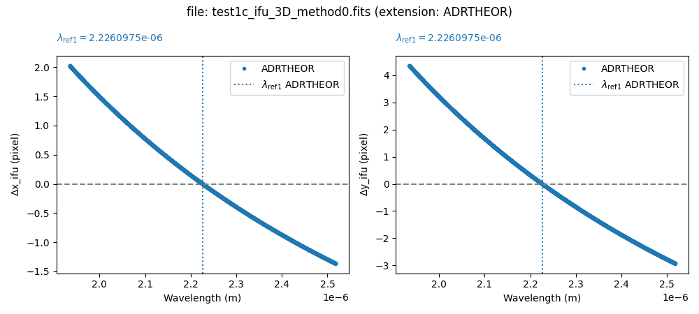

**Important**: the previous step stores the correction to be applied but does
not apply it to the data. To perform this process, we need to use an additional
script.

We see that a new extension ``ADRTHEOR`` has appeared in each data cube.

.. code-block:: console

   (venv_frida) $ fitsinfo test1*3D*.fits

.. code-block:: console
   :class: my-special-block no-copybutton

   Filename: test1a_ifu_3D_method0.fits
   No.    Name      Ver    Type      Cards   Dimensions   Format
     0  PRIMARY       1 PrimaryHDU      82   (64, 60, 2048)   int16 (rescales to uint16)   
   
   Filename: test1b_ifu_3D_method0.fits
   No.    Name      Ver    Type      Cards   Dimensions   Format
     0  PRIMARY       1 PrimaryHDU      84   (64, 60, 2048)   int16 (rescales to uint16)   
     1  ADRTHEOR      1 BinTableHDU     21   2048R x 2C   [D, D]   
   
   Filename: test1c_ifu_3D_method0.fits
   No.    Name      Ver    Type      Cards   Dimensions   Format
     0  PRIMARY       1 PrimaryHDU      84   (64, 60, 2048)   int16 (rescales to uint16)   
     1  ADRTHEOR      1 BinTableHDU     21   2048R x 2C   [D, D]   

We can also empirically measure atmospheric refraction in each data cube using
cross-correlation.

.. code-block:: console

   (venv_frida) $ numina-measure_slice_xy_offsets_in_3d_cube \
     test1b_ifu_3D_method0.fits \
     100 \
     --iterate \
     --extname adrcross \
     --verbose --iterate --plots

.. code-block:: console

   (venv_frida) $ numina-measure_slice_xy_offsets_in_3d_cube \
     test1c_ifu_3D_method0.fits \
     100 \
     --iterate \
     --extname adrcross \
     --verbose --iterate --plots

The previous procedure has added a new extension ``ADRCROSS`` to each of the
corrected images.

.. code-block:: console

   (venv_frida) $ fitsinfo test1*3D*.fits

.. code-block:: console
   :class: my-special-block no-copybutton

   Filename: test1a_ifu_3D_method0.fits
   No.    Name      Ver    Type      Cards   Dimensions   Format
     0  PRIMARY       1 PrimaryHDU      82   (64, 60, 2048)   int16 (rescales to uint16)   
   
   Filename: test1b_ifu_3D_method0.fits
   No.    Name      Ver    Type      Cards   Dimensions   Format
     0  PRIMARY       1 PrimaryHDU      84   (64, 60, 2048)   int16 (rescales to uint16)   
     1  ADRTHEOR      1 BinTableHDU     21   2048R x 2C   [D, D]   
     2  ADRCROSS      1 BinTableHDU     24   2048R x 2C   [D, D]   
   
   Filename: test1c_ifu_3D_method0.fits
   No.    Name      Ver    Type      Cards   Dimensions   Format
     0  PRIMARY       1 PrimaryHDU      84   (64, 60, 2048)   int16 (rescales to uint16)   
     1  ADRTHEOR      1 BinTableHDU     21   2048R x 2C   [D, D]   
     2  ADRCROSS      1 BinTableHDU     24   2048R x 2C   [D, D] 

We can easily compare the expected atmospheric refraction with that calculated
using the cross-correlation technique.

.. code-block:: console

   (venv_frida) $ numina-compare_adr_extensions_in_3d_cube \
     test1b_ifu_3D_method0.fits \
     adrcross adrtheor

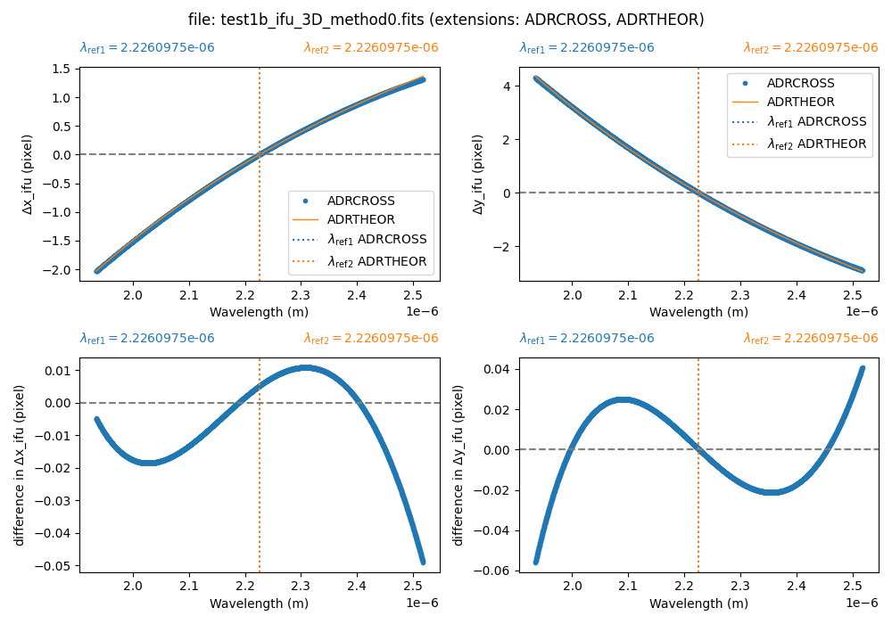

At this point, we can correct the exposures for atmospheric refraction using
the preferred extension (in this case, ``ADRCROSS`` or ``ADRTHEOR``).

.. code-block:: console

   (venv_frida) $ numina-adr_correction_from_extension_in_3d_cube \
     test1b_ifu_3D_method0.fits \
     --extname_adr adrtheor \
     --extname_mask None \
     --output test1b_ifu_3D_method0_corrected_ADRTHEOR.fits \
     --verbose

.. literalinclude:: mosaics/execution_adr_correction_from_extension_test1b.txt
   :class: my-special-block no-copybutton

.. code-block:: console

   (venv_frida) $ numina-adr_correction_from_extension_in_3d_cube \
     test1c_ifu_3D_method0.fits \
     --extname_adr adrtheor \
     --extname_mask None \
     --output test1c_ifu_3D_method0_corrected_ADRTHEOR.fits \
     --verbose

.. literalinclude:: mosaics/execution_adr_correction_from_extension_test1c.txt
   :class: my-special-block no-copybutton

Next, we add the 3 cubes (the first one uncorrected and the second and third
cubes corrected).

.. code-block:: console

   (venv_frida) $ ls test1a_ifu_3D_method0.fits \
     test1*_ADRTHEOR.fits > list1_3d_images_ADRTHEOR.txt

.. code-block:: console

   (venv_frida) $ cat list1_3d_images_ADRTHEOR.txt

.. code-block:: console
   :class: my-special-block no-copybutton

   test1a_ifu_3D_method0.fits
   test1b_ifu_3D_method0_corrected_ADRTHEOR.fits
   test1c_ifu_3D_method0_corrected_ADRTHEOR.fits

.. code-block:: console

   (venv_frida) $ numina-generate_mosaic_of_3d_cubes \
     list1_3d_images_ADRTHEOR.txt \
     combination_test1_3d_ADRTHEOR.fits \
     --verbose

.. literalinclude:: mosaics/execution_combination_test1_3d_ADR.txt
   :class: my-special-block no-copybutton

.. code-block:: console

   (venv_frida) $ ds9 \
     -scale mode minmax \
     -geometry 1000x1000 \
     -wcs degrees \
     -multiframe \
     test1a_ifu_3D_method0.fits \
     test1b_ifu_3D_method0_corrected_ADRTHEOR.fits \
     test1c_ifu_3D_method0_corrected_ADRTHEOR.fits \
     combination_test1_3d_ADRTHEOR.fits \
     -lock slice image \
     -lock frame image \
     -zoom to fit \
     -cmap viridis \
     -match frame colorbar \
     -match frame wcs \
     -colorbar lock yes \
     -view multi yes

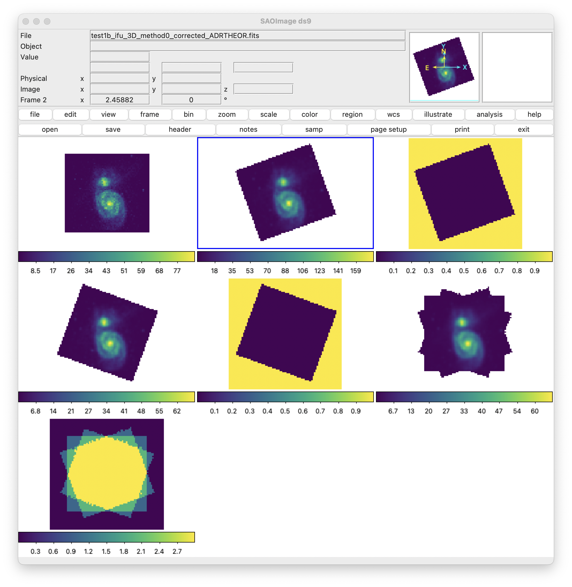

In the upper image, from top to bottom and left to right, we have the cubes
corresponding to: the first exposure, the second exposure corrected using
``ADRTHEOR``, the mask of the previous cube, the third exposure corrected using
``ADRTHEOR``, the mask of the previous cube, the combination of the 3 cubes, and
the footprint of that combination. It is very interesting to move along the
wavelength using the slider that ``ds9`` provides in an auxiliary window.

Finally, we can compare the effect of correcting or not correcting for
atmospheric refraction.

.. code-block:: console

   (venv_frida) $ ds9 \
     -scale mode minmax \
     -geometry 1000x1000 \
     -wcs degrees \
     -multiframe \
     combination_test1_3d.fits \
     combination_test1_3d_ADRTHEOR.fits \
     -lock slice image \
     -lock frame image \
     -zoom to fit \
     -cmap viridis \
     -match frame colorbar \
     -match frame wcs \
     -colorbar lock yes \
     -view multi yes

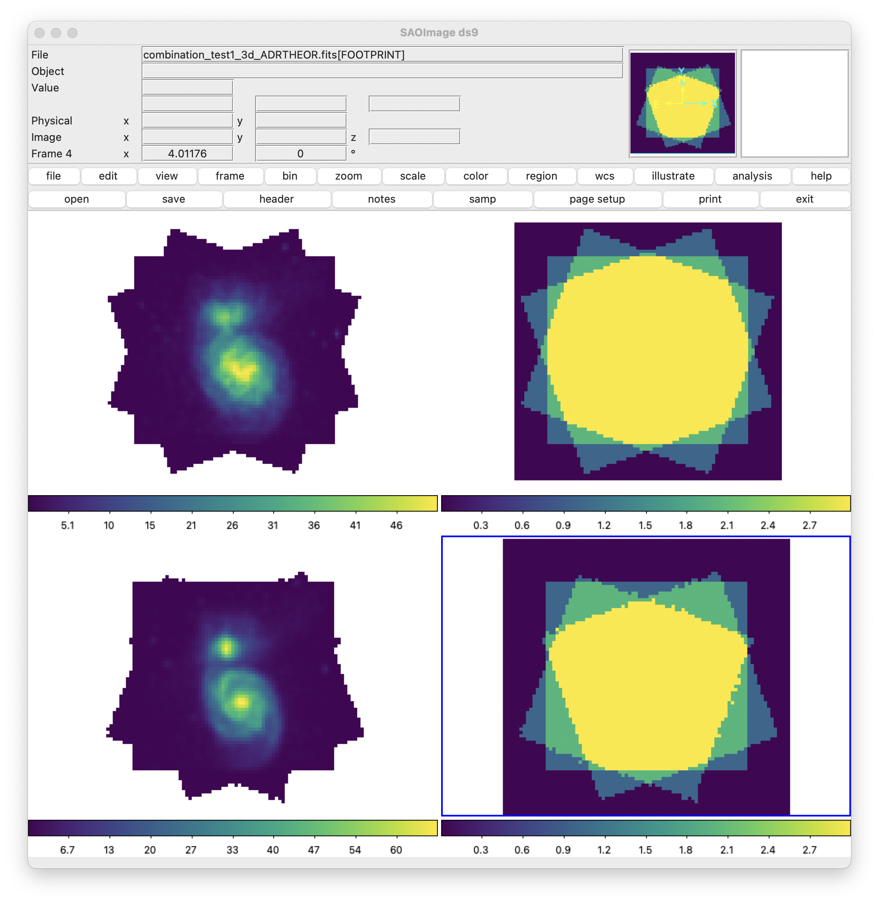

The top row shows the combined cube and the associated footprint when the
combination is carried out without taking into account the effect of
differential atmospheric refraction, while the bottom row shows the result when
this effect is taken into account. Once again, it is important to interact with
the display by moving along the wavelength.

**ToDo**: add the option to correct for atmospheric refraction by generating a
corrected cube with a predefined celestial WCS with an arbitrary size.  In this
way, instead of interpolating when correcting for atmospheric refraction and
when combining cubes with different pointings, we would only perform a single
interpolation at the time of atmospheric refraction correction.
