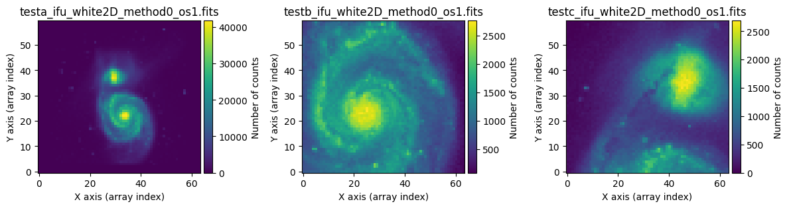
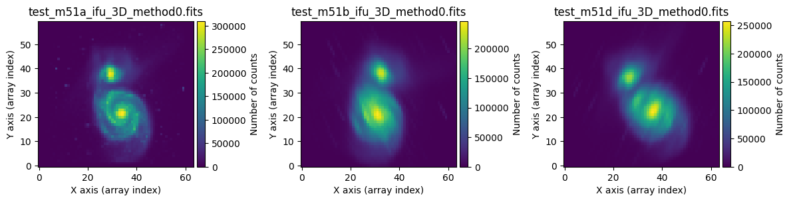
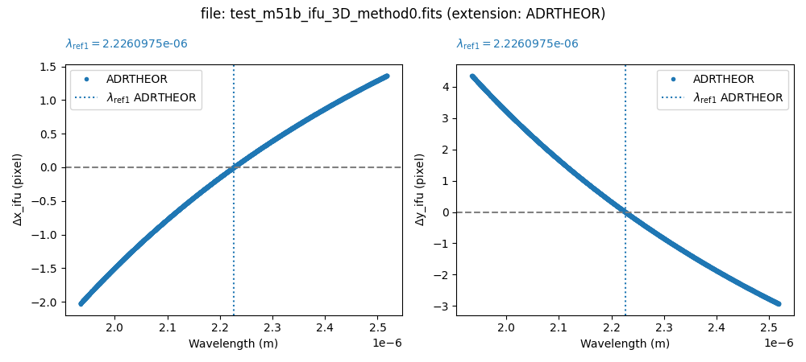
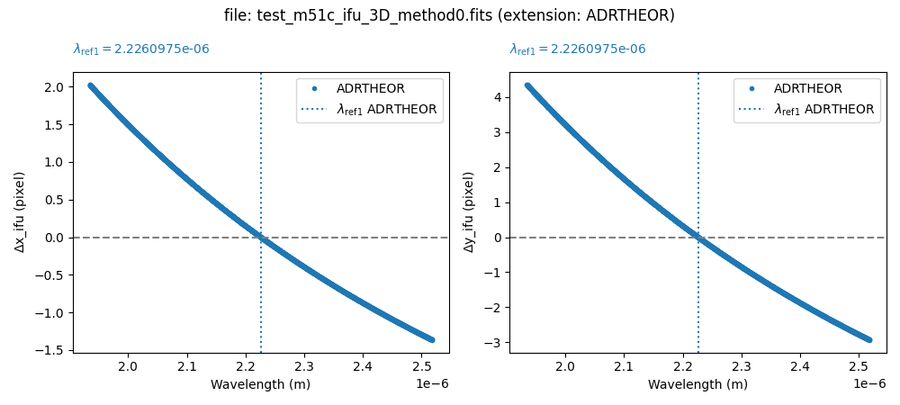

Generation of data cube mosaics
===============================

Here is the procedure that can be used to generate mosaics with data cubes.

.. warning::

   Please note that the code shown below is under development and may undergo
   modifications.

Before tackling the combination of 3D data cubes, let's see how the ``numina``
package facilitates the combination of 2D images.

Combination of 2D images
------------------------

For this example we are using the files :download:`scene_m51_2d.yaml
<mosaics/scene_m51_2d.yaml>` and :download:`m51_dss1.fits
<mosaics/m51_dss1.fits>`.

Execute ``fridadrp-ifu_simulator``:

.. code-block:: console

   (venv_frida) $ fridadrp-ifu_simulator \
     --scene scene_m51_2d.yaml \
     --grating medium-K \
     --scale coarse \
     --delta_ra_teles_arcsec 0.0 \
     --delta_dec_teles_arcsec 0.0 \
     --instrument_pa_deg 0.0 \
     --flatpix2pix none \
     --stop_after_ifu_3D_method0 \
     --prefix_intermediate_FITS testa

.. code-block:: console

   (venv_frida) $ fridadrp-ifu_simulator \
     --scene scene_m51_2d.yaml \
     --grating medium-K \
     --scale fine \
     --delta_ra_teles_arcsec -0.1 \
     --delta_dec_teles_arcsec -0.2 \
     --instrument_pa_deg 40.0 \
     --flatpix2pix none \
     --stop_after_ifu_3D_method0 \
     --prefix_intermediate_FITS testb

.. code-block:: console

   (venv_frida) $ fridadrp-ifu_simulator \
     --scene scene_m51_2d.yaml \
     --grating medium-K \
     --scale fine \
     --delta_ra_teles_arcsec 0.2 \
     --delta_dec_teles_arcsec 0.2 \
     --instrument_pa_deg 20.0 \
     --flatpix2pix none \
     --stop_after_ifu_3D_method0 \
     --prefix_intermediate_FITS testc

We have used the parameter ``--stop_after_ifu_3D_method0`` because we do not
need to execute all the steps of the simulator to generate the images we will
need in this case. Note that the first execution uses ``--scale coarse``, while the
next two use ``--scale fine``. Additionally, the values of
``--delta_ra_teles_arcsec``, ``--delta_dec_teles_arcsec``, and
``--instrument_pa_deg are modified``.

The next step is to generate an auxiliary text file with the names of the FITS
images to be combined.

.. code-block:: console

   (venv_frida) $ ls test?_ifu_white2D_method0_os1.fits > list_2d_images.txt
   (venv_frida) $ cat list_2d_images.txt
   testa_ifu_white2D_method0_os1.fits
   testb_ifu_white2D_method0_os1.fits
   testc_ifu_white2D_method0_os1.fits

To combine the 3 selected images, we only need to execute the following Numina
script:

.. code-block:: console

   (venv_frida) $ numina-generate_mosaic_of_2d_images \
     list_2d_images.txt combination_2d.fits \
     --verbose
   input_list: list_2d_images.txt
   output_filename: combination_2d.fits
   reproject_method: adaptive
   extname_image: PRIMARY
   extname_mask: None
   combination_function: mean
   output_3D_stack: None
   verbose: True
   echo: False

   * Reading: testa_ifu_white2D_method0_os1.fits
   hdu2d_image.header['NAXIS1']=64
   hdu2d_image.header['NAXIS2']=60
   generating mask from np.nan values
   Number of masked pixels / total: 0 / 3840
   
   * Reading: testb_ifu_white2D_method0_os1.fits
   hdu2d_image.header['NAXIS1']=64
   hdu2d_image.header['NAXIS2']=60
   generating mask from np.nan values
   Number of masked pixels / total: 0 / 3840
   
   * Reading: testc_ifu_white2D_method0_os1.fits
   hdu2d_image.header['NAXIS1']=64
   hdu2d_image.header['NAXIS2']=60
   generating mask from np.nan values
   Number of masked pixels / total: 0 / 3840
   Total number of images to be combined: 3
   
   wcs_mosaic2d=WCS Keywords
   
   Number of WCS axes: 2
   CTYPE : 'RA---TAN' 'DEC--TAN' 
   CRVAL : 9.259258514947486e-06 0.0 
   CRPIX : 125.16666693574936 120.50000000417663 
   PC1_1 PC1_2  : 1.0 0.0 
   PC2_1 PC2_2  : 0.0 1.0 
   CDELT : -2.7777777777777233e-06 2.7777777777777233e-06 
   NAXIS : 0  0
   shape_mosaic2d=(240, 256)
   Reprojection method: adaptive
   Combination function: mean
   
   Saving combined 2D image: combination_2d.fits
   
Next, we compare the result of the combination of the 3 simulated exposures 
with the first exposure alone: both
cover the field of the *coarse* camera. The improvement in spatial resolution
in the combined image is noticeable after including the two pointings made with
the *fine* camera.  Note that the combined image has the sampling corresponding
to the *fine* camera. Hence, the number of counts shows such a different value
in both images.

.. image:: mosaics/comparison_combined_single.png
   :width: 100%

The following figure shows the result of combining the two exposures obtained
with the 'fine' camera, represented on top of the first exposure calculated
with an oversampling of 10 (file ``testa_ifu_white2D_method0_os10.fits``).

.. image:: mosaics/combined_with_bw_background.png
   :align: center
   :width: 70%

Generation of example 3D data cubes
-----------------------------------

For this example we are using the files :download:`scene_m51_3d.yaml
<mosaics/scene_m51_3d.yaml>` and :download:`m51_dss1.fits
<mosaics/m51_dss1.fits>`.

Execute ``fridadrp-ifu_simulator``:

.. code-block:: console

   (venv_frida) $ fridadrp-ifu_simulator \
     --scene scene_m51_3d.yaml \
     --grating medium-K \
     --scale fine \
     --airmass 1.0 \
     --parallactic_angle_deg 0 \
     --instrument_pa_deg 0 \
     --stop_after_ifu_3D_method0 \
     --prefix_intermediate_FITS test_m51a \
     --seed 1234
     
.. code-block:: console

   (venv_frida) $ fridadrp-ifu_simulator \
     --scene scene_m51_3d.yaml \
     --grating medium-K \
     --scale fine \
     --airmass 3.00 \
     --parallactic_angle_deg 45 \
     --instrument_pa_deg 20 \
     --stop_after_ifu_3D_method0 \
     --prefix_intermediate_FITS test_m51b \
     --seed 2345

.. code-block:: console

   (venv_frida) $ fridadrp-ifu_simulator \
     --scene scene_m51_3d.yaml \
     --grating medium-K \
     --scale fine \
     --airmass 3.00 \
     --parallactic_angle_deg -45 \
     --instrument_pa_deg 340 \
     --stop_after_ifu_3D_method0 \
     --prefix_intermediate_FITS test_m51c \
     --seed 3456

We have used again the parameter ``--stop_after_ifu_3D_method0`` because we do
not need to execute all the steps of the simulator to generate the images we
will need in this example. In all cases, we are using the *fine* camera.  In
the first exposure, the airmass is 1.0. In the next two exposures we have
chosen a high airmass to exaggerate the effect of atmospheric refraction,
modifying both the value of the parallactic angle and the instrument.

We can quickly visualize the result with the help of the ``qfitsview`` program.
With the idea of being able to change the slice in the spectral direction
simultaneously in the three exposures, we will first generate an auxiliary
image that performs a stack of the HDUs (header and data units) from different
FITS files into a single FITS file.

.. code-block:: console

   (venv_frida) $ fitsinfo test_m51*3D*.fits
   Filename: test_m51a_ifu_3D_method0.fits
   No.    Name      Ver    Type      Cards   Dimensions   Format
     0  PRIMARY       1 PrimaryHDU      81   (64, 60, 2048)   float32   

   Filename: test_m51b_ifu_3D_method0.fits
   No.    Name      Ver    Type      Cards   Dimensions   Format
     0  PRIMARY       1 PrimaryHDU      83   (64, 60, 2048)   float32   

   Filename: test_m51c_ifu_3D_method0.fits
   No.    Name      Ver    Type      Cards   Dimensions   Format
     0  PRIMARY       1 PrimaryHDU      83   (64, 60, 2048)   float32   

   (venv_frida) $ ls test_m51*3D*.fits > list_3d_images.txt

   (venv_frida) $ cat list_3d_images.txt
   test_m51a_ifu_3D_method0.fits
   test_m51b_ifu_3D_method0.fits
   test_m51c_ifu_3D_method0.fits

   (venv_frida) $ numina-stack_hdus list_3d_images.txt stack_3d.fits

   (venv_frida) $ qfitsview stack_3d.fits

After executing the last command, select 'Read All' when ``qfitsview`` asks for
the extension to read.

If we collapse the data cubes along the spectral direction (NAXIS3), the effect
of atmospheric refraction is clearly noticeable.

If we combine the 3 data cubes ignoring the problem of atmospheric refraction,
the result is not satisfactory.

.. code-block:: console

   (venv_frida) $ numina-generate_mosaic_of_3d_cubes \
     list_3d_images.txt \
     combination_3d.fits \
     --verbose

   $ fitsinfo combination_3d.fits
   Filename: combination_3d.fits
   No.    Name      Ver    Type      Cards   Dimensions   Format
     0  PRIMARY       1 PrimaryHDU      27   (81, 78, 2048)   float32   
     1  FOOTPRINT     1 ImageHDU        29   (81, 78, 2048)   uint8  

   $ qfitsview combination_3d.fits

It is advisable to correct the individual exposures first before combining the
different data cubes. 

We can use an initial script that allows us to understand the expected effect
of atmospheric refraction.

.. code-block:: console

   (venv_frida) $ numina-compute_adr_wavelength \
      --airmass 3 \
      --reference_wave_vacuum 1.7 \
      --wave_ini 1.0 \
      --wave_end 2.5 \
      --wave_step 0.1 \
      --wave_unit micron \
      --plots

   Wavelength  ADR  
     micron   arcsec
   ---------- ------
        1.000  0.483
        1.100  0.355
        1.200  0.257
        1.300  0.181
        1.400  0.121
        1.500  0.072
        1.600  0.033
        1.700  0.000
        1.800 -0.027
        1.900 -0.051
        2.000 -0.071
        2.100 -0.088
        2.200 -0.102
        2.300 -0.115
        2.400 -0.127
        2.500 -0.137
   
.. image:: mosaics/adr_prediction.png
   :align: center
   :width: 60%

When correcting each individual exposure, we will first insert an extension
with a binary table that stores the effect of atmospheric refraction into each
FITS file.

.. code-block:: console

   (venv_frida) $ numina-include_adrtheor_in_3d_cube \
     test_m51b_ifu_3D_method0.fits \
     --verbose --plots

   (venv_frida) $ numina-include_adrtheor_in_3d_cube \
     test_m51c_ifu_3D_method0.fits \
     --verbose --plots

**Important**: the previous step stores the correction to be applied but does
not apply it to the data. To perform this process, we need to use an additional
script.

We see that a new extension ``ADRTHEOR`` has appeared in each data cube.

.. code-block:: console

   (venv_frida) $ fitsinfo test_m51*3D*.fits
   Filename: test_m51a_ifu_3D_method0.fits
   No.    Name      Ver    Type      Cards   Dimensions   Format
     0  PRIMARY       1 PrimaryHDU      81   (64, 60, 2048)   float32   
     1  ADRTHEOR      1 BinTableHDU     21   2048R x 2C   [D, D]   

   Filename: test_m51b_ifu_3D_method0.fits
   No.    Name      Ver    Type      Cards   Dimensions   Format
     0  PRIMARY       1 PrimaryHDU      83   (64, 60, 2048)   float32   
     1  ADRTHEOR      1 BinTableHDU     21   2048R x 2C   [D, D]   

   Filename: test_m51c_ifu_3D_method0.fits
   No.    Name      Ver    Type      Cards   Dimensions   Format
     0  PRIMARY       1 PrimaryHDU      83   (64, 60, 2048)   float32   
     1  ADRTHEOR      1 BinTableHDU     21   2048R x 2C   [D, D]   

We can also empirically measure atmospheric refraction in each data cube using
cross-correlation.

.. code-block:: console

   (venv_frida) $ numina-measure_slice_xy_offsets_in_3d_cube \
     test_m51b_ifu_3D_method0.fits \
     100 \
     --iterate \
     --extname adrcross \
     --verbose --iterate --plots

   (venv_frida) $ numina-measure_slice_xy_offsets_in_3d_cube \
     test_m51c_ifu_3D_method0.fits \
     100 \
     --iterate \
     --extname adrcross \
     --verbose --iterate --plots

The previous procedure has added a new extension ``ADRCROSS`` to each of the
corrected images.

.. code-block:: console

   (venv_frida) $ fitsinfo test_m51*3D*.fits
   Filename: test_m51a_ifu_3D_method0.fits
   No.    Name      Ver    Type      Cards   Dimensions   Format
     0  PRIMARY       1 PrimaryHDU      81   (64, 60, 2048)   float32   
     1  ADRTHEOR      1 BinTableHDU     21   2048R x 2C   [D, D]   

   Filename: test_m51b_ifu_3D_method0.fits
   No.    Name      Ver    Type      Cards   Dimensions   Format
     0  PRIMARY       1 PrimaryHDU      83   (64, 60, 2048)   float32   
     1  ADRTHEOR      1 BinTableHDU     21   2048R x 2C   [D, D]   
     2  ADRCROSS      1 BinTableHDU     24   2048R x 2C   [D, D]   

   Filename: test_m51c_ifu_3D_method0.fits
   No.    Name      Ver    Type      Cards   Dimensions   Format
     0  PRIMARY       1 PrimaryHDU      83   (64, 60, 2048)   float32   
     1  ADRTHEOR      1 BinTableHDU     21   2048R x 2C   [D, D]   
     2  ADRCROSS      1 BinTableHDU     24   2048R x 2C   [D, D]  

We can easily compare the expected atmospheric refraction with that calculated
using the cross-correlation technique.

.. code-block:: console

   (venv_frida) $ numina-compare_adr_extensions_in_3d_cube \
     test_m51b_ifu_3D_method0.fits \
     adrcross adrtheor

.. image:: mosaics/adrcross_adrtheor.png
   :align: center
   :width: 80%

At this point, we can correct the exposures for atmospheric refraction using
the preferred extension (in this case, ``ADRCROSS`` or ``ADRTHEOR``).

.. code-block:: console

   (venv_frida) $ numina-adr_correction_from_extension_in_3d_cube \
     test_m51b_ifu_3D_method0.fits \
     --extname_adr adrtheor \
     --extname_mask None \
     --output test_m51b_ifu_3D_method0_corrected_ADRTHEOR.fits \
     --verbose

   (venv_frida) $ numina-adr_correction_from_extension_in_3d_cube \
     test_m51c_ifu_3D_method0.fits \
     --extname_adr adrtheor \
     --extname_mask None \
     --output test_m51c_ifu_3D_method0_corrected_ADRTHEOR.fits \
     --verbose

.. code-block:: console

   (venv_frida) $ ls test_m51a_ifu_3D_method0.fits \
     test_m51*_ADRTHEOR.fits > list_3d_images_ADRTHEOR.txt

   (venv_frida) cat list_3d_images_ADRTHEOR.txt
   test_m51a_ifu_3D_method0.fits
   test_m51b_ifu_3D_method0_corrected_ADRTHEOR.fits
   test_m51c_ifu_3D_method0_corrected_ADRTHEOR.fits

Now we can add the 3 data cubes.

.. code-block:: console

   (venv_frida) $ numina-generate_mosaic_of_3d_cubes \
     list_3d_images_ADRTHEOR.txt \
     combination_3d_ADRTHEOR.fits \
     --verbose

   (venv_frida) $ qfitsview combination_3d_ADRTHEOR.fits

Finally, we can compare the effect of correcting or not correcting for
atmospheric refraction.

.. code-block:: console

   (venv_frida) $ ls combination_3d*.fits > list_3d_combinations.txt

   (venv_frida) $ numina-stack_hdus list_3d_combinations.txt stack_3d_combinations.fits

   (venv_frida) $ qfitsview stack_3d_combinations.fits

ToDo: add the option to correct for atmospheric refraction by generating a
corrected cube with a predefined celestial WCS with an arbitrary size.  In this
way, instead of interpolating when correcting for atmospheric refraction and
when combining cubes with different pointings, we would only perform a single
interpolation at the time of atmospheric refraction correction.
