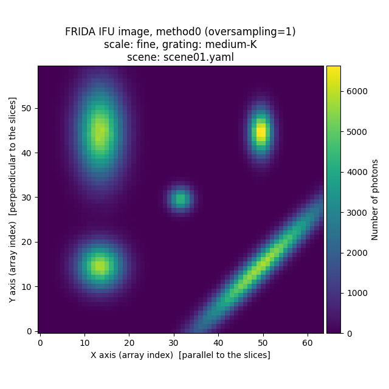
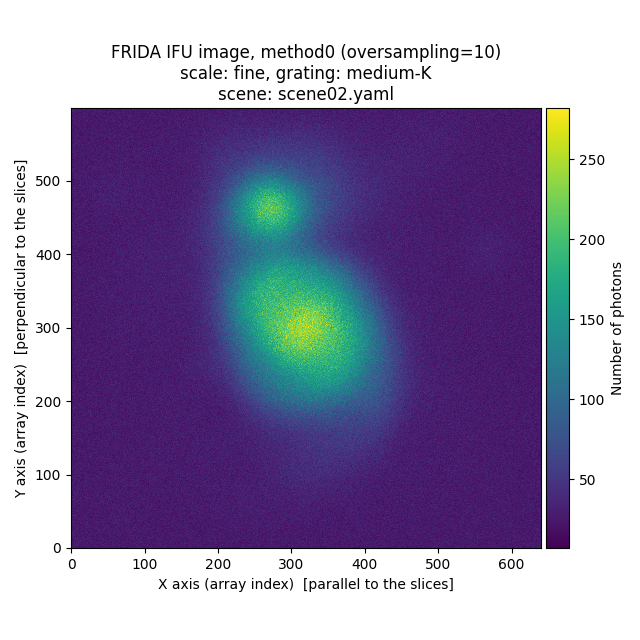
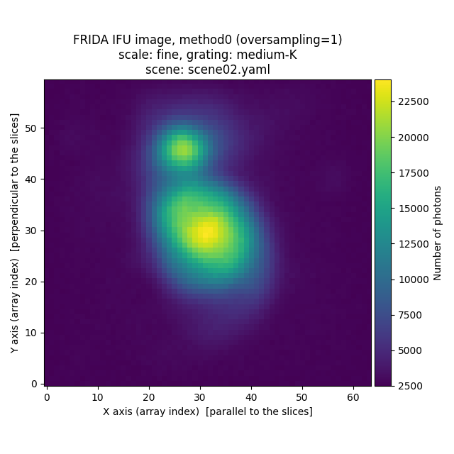

Some scene examples
===================

Below are some examples of 'scene' files as well as the resulting simulated
images.

Example 1: collection of Gaussian objects
-----------------------------------------

Here we are using the file :download:`scene01.yaml
<scene01/scene01.yaml>`.

.. literalinclude:: scene01/scene01.yaml

Execute ``fridadrp-ifu_simulator``:

.. code-block:: console

   (venv_frida) $ fridadrp-ifu_simulator \
     --scene scene01.yaml \
     --grating medium-K \
     --scale fine \
     --flatpix2pix none
   Welcome to fridadrp-ifu_simulator
   version 0.1.dev98+g0c982ee

   * Processing: Gaussian center
   * Processing: Gaussian top left
   * Processing: Gaussian bottom left
   * Processing: Gaussian top right
   * Processing: Gaussian bottom right
   Saving file: test_ifu_white2D_method0_os10.fits
   Saving file: test_ifu_white2D_method0_os1.fits
   Saving file: test_ifu_3D_method0.fits
   Saving file: test_rss_2D_method0.fits
   Saving file: test_detector_2D_method0.fits
   Saving file: test_rss_2D_method1.fits
   Saving file: test_ifu_3D_method1.fits

.. image:: scene01/Figure_1.png
   :width: 49%

Example 2: M51-like galaxy
--------------------------

Here we are using the file :download:`scene02.yaml
<scene02/scene02.yaml>`. 

.. literalinclude:: scene02/scene02.yaml

We aim to simulate a galaxy resembling the morphology of Messier 51. To achieve
this, we generated a :math:`{15 \times 15}~{\rm arcmin}^2` image using the `ESO
Online Digitized Sky Survey <https://archive.eso.org/dss/dss>`_. The
corresponding file is `m51_dss1.fits
<https://guaix.fis.ucm.es/data/fridadrp/m51_dss1.fits>`_.

Execute ``fridadrp-ifu_simulator``:

.. code-block:: console

   (venv_frida) $ fridadrp-ifu_simulator \
     --scene scene02.yaml \
     --grating medium-K \
     --scale fine \
     --seeing_fwhm_arcsec 0.05 \
     --flatpix2pix none
   Welcome to fridadrp-ifu_simulator
   version 0.1.dev98+g0c982ee

   * Processing: M51 DSS1
   * Processing: skycalc radiance
   Ignoring wave_unit: m (assuming nm)
   Saving file: test_ifu_white2D_method0_os10.fits
   Saving file: test_ifu_white2D_method0_os1.fits
   Saving file: test_ifu_3D_method0.fits
   Saving file: test_rss_2D_method0.fits
   Saving file: test_detector_2D_method0.fits
   Saving file: test_rss_2D_method1.fits
   Saving file: test_ifu_3D_method1.fits

