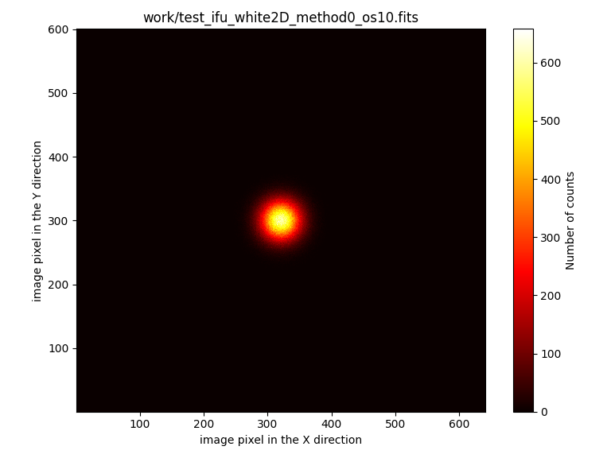
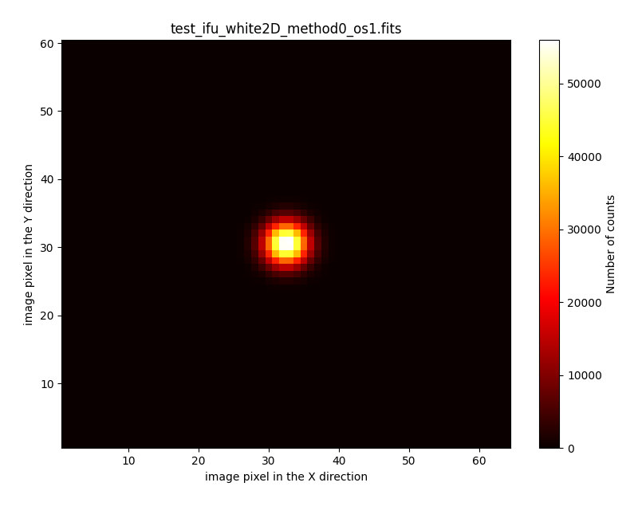
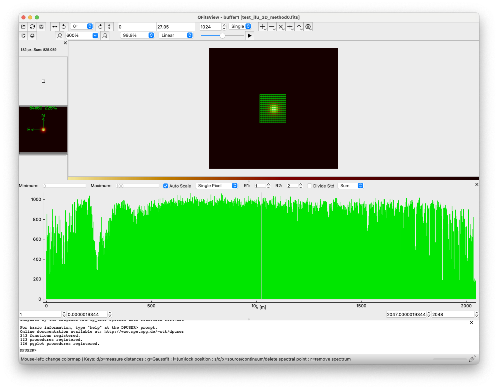
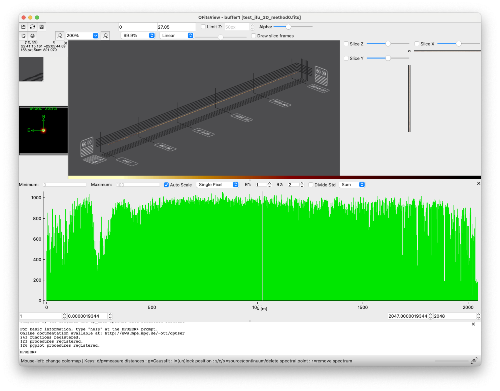
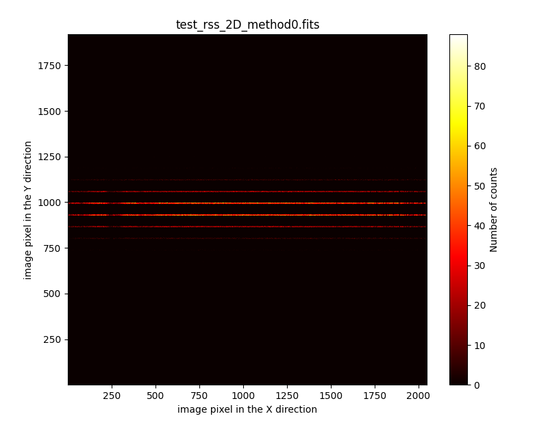
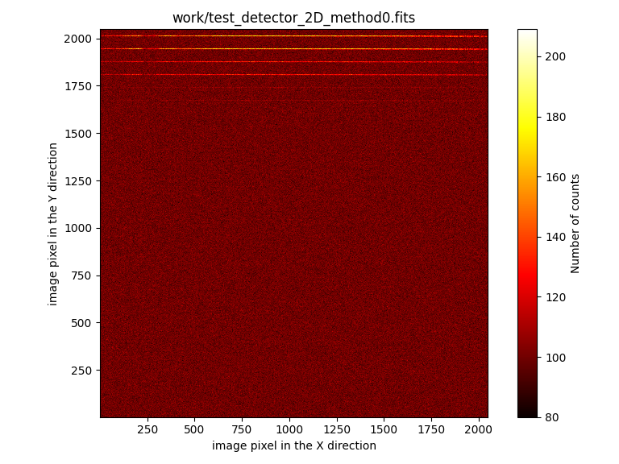
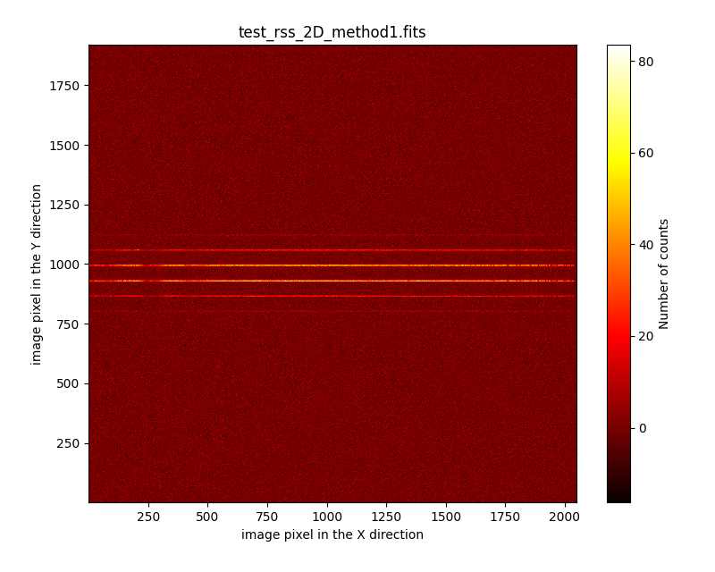
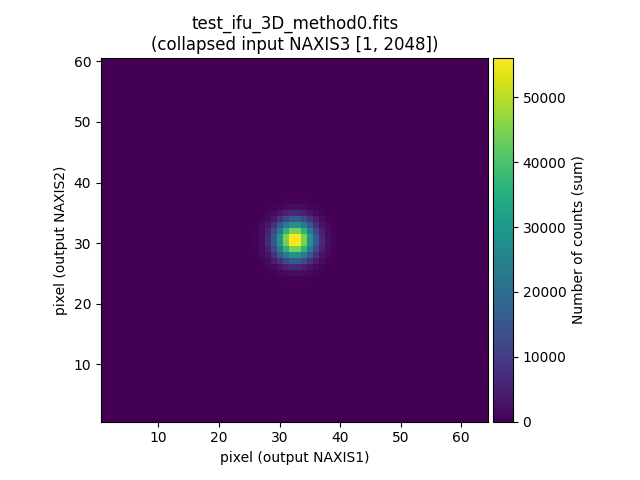
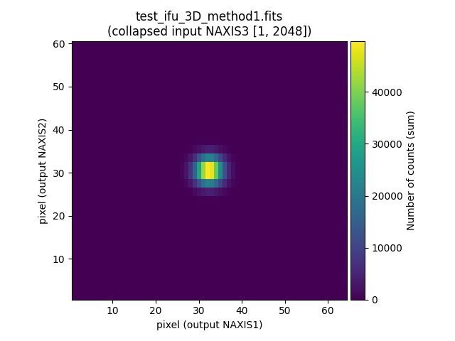

.. role:: raw-html(raw)
   :format: html

Initial example
===============

.. warning:: 

   The first time you execute ``fridadrp-ifu_simulator`` the output in
   the terminal will show that some auxiliary files are downloaded and stored
   in a cache directory. You don't need to be concerned about the specific
   location unless you want to have a look at these files.

To facilitate the identification of the script parameters, we are making use of
the backslash ``\`` symbol to indicate a line continuation. The backslash
symbol escapes the next character from being interpreted by the shell. If the
next character after the backslash is a newline character, then that newline
will not be interpreted as the end of the command by the shell. Instead, it
effectively allows a command to span multiple lines.

.. code-block:: console

   (venv_frida) $ fridadrp-ifu_simulator \
     --scene scene00.yaml \
     --grating medium-K \
     --scale fine \
     --seeing_fwhm_arcsec 0.05 \
     --rnoise 4
   Welcome to fridadrp-ifu_simulator
   version 0.1.dev122+g9cc23a9
   
   * Processing: constant flux
   Saving file: test_ifu_white2D_method0_os10.fits
   Saving file: test_ifu_white2D_method0_os1.fits
   Saving file: test_ifu_3D_method0.fits
   Saving file: test_rss_2D_method0.fits
   Saving file: test_detector_2D_method0.fits
   Saving file: test_rss_2D_method1.fits
   Saving file: test_ifu_3D_method1.fits
   Program stopped

The first parameter, ``--scene``, indicates the name of the external YAML file
that contains the *scene* description. Its content is explained next.
The second and third parameters, ``--grating`` and ``--scale``, indicate the
grating and scale defining the wavelength range and sampling, as well as the
spatial scale in the IFU field of view. In this example, we are using the
medium-K grating and the fine scale camera. Finally, we are indicating that the
seeing FWHM is 0.05 arcsec and the detector readout noise 4 ADU.

.. _The scene file of the initial example:

The scene file of the initial example
-------------------------------------

In this specific example, we are using the file :download:`scene00.yaml
<scene00/scene00.yaml>`.

.. literalinclude:: scene00/scene00.yaml

The relevant information is provided as mappings and collections using
indentation for scope. In this case the following first-order keys are 
identified:

- ``scene_block_name``: the provided string is an arbitrary label defined by
  the user to identify this *scene block*.

- ``spectrum``: this key opens an indented section that contains all the
  information required to define the kind of spectrum to be associated to the
  geometry described next. In this example we want to simulate a constant flux
  spectrum, which is indicated by the key ``type: constant-flux``.

- ``geometry``: this key opens an indented section that indicates how the
  photons generated following the previous spectrum type are going to be
  distributed in the IFU field of view.  In this example, we are using ``type:
  point-like``, meaning that we want to place all the simulated photons at
  the same point (by default, the center of the IFU field of view).

- ``nphotons``: total number of photons to be simulated.

- ``apply_seeing``: boolean key indicating whether seeing must be taken into
  account. If ``True``, each simulated photon is randomly displaced in the
  focal plane of the IFU according to a probability distribution that is
  determined by the seeing PSF.

- ``apply_atmosphere_transmission``: boolean key indicating whether the
  atmosphere transmission must be considered. If ``True``, the atmospheric
  transmission probability at the wavelength of each simulated photon is
  evaluated, and a random number between 0 and 1 is generated in each case. If
  the obtained number is greater than the transmission probability, the photon
  is discarded.

- ``render``: boolean key indicate whether the considered scene block must be
  simulated. In this case, in which we only have a single scene block, this key
  is not very relevant (it only makes sense ``render: True``). But in more
  complicated cases, it is useful to be able to set this key to ``False`` when
  we want to simulate images with several objects and components in the IFU
  field of view and one needs to remove some particular objects from the
  simulation without deleting the corresponding lines in the YAML file.

Files generated by the IFU simulator
------------------------------------

The execution of the IFU simulator generates several files. All of them
share the same prefix ``test``. This can be easily modified using the parameter
``--prefix_intermediate_FITS`` when running ``fridadrp-ifu_simulator``.

.. list-table:: Files generated by the simulator
   :widths: 40, 60
   :header-rows: 1

   * - Filename
     - Short description
   * - test_ifu_white2D_method0_os10.fits
     - White light image of the IFU with oversampling 10 (default)
   * - test_ifu_white2D_method0_os1.fits
     - White light image of the IFU without oversampling
   * - test_ifu_3D_method0.fits
     - 3D data cube of the simulated photons
   * - test_rss_2D_method0.fits
     - RSS version of the previous 3D data cube
   * - test_detector_2D_method0.fits
     - Hawaii detector version of the simulated photons
   * - test_rss_2D_method1.fits
     - Reconstructed RSS image from the Hawaii image
   * - test_ifu_3D_method1.fits
     - Reconstructed 3D data cube built from the previous RSS image

These files store different steps of the simulation procedure. Details follow.

:raw-html:`<code>test_ifu_white2D_method0_os10.fits</code>`
...........................................................

White-light image corresponding to the IFU field of view, using a particular
oversampling. By default, the oversampling is set to 10, and for that reason
the last part of the file name before the extension is ``os10``. The
oversampling can be modified using the parameter ``--noversampling_whitelight``
when running ``fridadrp-ifu-simulator``.

Note that due to the oversampling factor, the shape of this image is
``NAXIS1=640`` and ``NAXIS2=600``.

.. numina-ximshow test_ifu_white2D_method0_os10.fits --geometry 800,640,0,0 --cbar_orientation vertical

:raw-html:`<code>test_ifu_white2D_method0_os1.fits</code>`
..........................................................

White-light image without oversampling.

Since we are not using oversampling, in this case ``NAXIS1=64`` and
``NAXIS2=60``.

.. numina-ximshow test_ifu_white2D_method0_os1.fits --geometry 800,640,0,0 --cbar_orientation vertical

:raw-html:`<code>test_ifu_3D_method0.fits</code>`
.................................................

3D data cube of the simulated photons. In this case
``NAXIS1=64`` and ``NAXIS2=60`` and ``NAXIS3=2048``.

.. code-block:: console

   (venv_frida) $ fitsheader test_ifu_3D_method0.fits 
   # HDU 0 in test_ifu_3D_method0.fits:
   SIMPLE  =                    T / conforms to FITS standard                      
   BITPIX  =                  -32 / array data type                                
   NAXIS   =                    3 / number of array dimensions                     
   NAXIS1  =                   64                                                  
   NAXIS2  =                   60                                                  
   NAXIS3  =                 2048                                                  
   EXTEND  =                    T                                                  
   WCSAXES =                    3 / Number of coordinate axes                      
   CRPIX1  =                 32.5 / Pixel coordinate of reference point            
   CRPIX2  =                 30.5 / Pixel coordinate of reference point            
   CRPIX3  =                  1.0 / Pixel coordinate of reference point            
   PC1_1   = -2.7777777777777E-06 / Coordinate transformation matrix element       
   PC2_2   =  2.7777777777778E-06 / Coordinate transformation matrix element       
   PC3_3   =             2.85E-10 / Coordinate transformation matrix element       
   CDELT1  =                  1.0 / [deg] Coordinate increment at reference point  
   CDELT2  =                  1.0 / [deg] Coordinate increment at reference point  
   CDELT3  =                  1.0 / [m] Coordinate increment at reference point    
   CUNIT1  = 'deg'                / Units of coordinate increment and value        
   CUNIT2  = 'deg'                / Units of coordinate increment and value        
   CUNIT3  = 'm'                  / Units of coordinate increment and value        
   CTYPE1  = 'RA---TAN'           / Right ascension, gnomonic projection           
   CTYPE2  = 'DEC--TAN'           / Declination, gnomonic projection               
   CTYPE3  = 'WAVE'               / Vacuum wavelength (linear)                     
   CRVAL1  =                  0.0 / [deg] Coordinate value at reference point      
   CRVAL2  =                  0.0 / [deg] Coordinate value at reference point      
   CRVAL3  =           1.9344E-06 / [m] Coordinate value at reference point        
   LONPOLE =                180.0 / [deg] Native longitude of celestial pole       
   LATPOLE =                  0.0 / [deg] Native latitude of celestial pole        
   MJDREF  =                  0.0 / [d] MJD of fiducial time                       
   RADESYS = 'ICRS'               / Equatorial coordinate system   
   OBSERVAT= 'ORM     '           / Name of the observatory (IRAF style)           
   TELESCOP= 'GTC     '           / Telescope name                                 
   ORIGIN  = 'fridadrp-ifu_simulator' / FITS file originator                       
   LATITUDE= '+28:45:43.2'        / Telescope latitude (degrees), +28:45:43.2      
   LONGITUD= '+17:52:39.5'        / Telescope longitude (degrees), +17:52:39.5     
   HEIGHT  =                 2348 / Telescope height above sea level (m)           
   AIRMASS =                  1.0 / Airmass                                        
   IPA     =                  0.0 / Instrument position angle (degrees)            
   PARANGLE=                  0.0 / Parallactic angle (degrees)                    
   INSTRUME= 'FRIDA   '           / Instrument name                                
   OBSMODE = 'IFS     '           / Observation mode                               
   SCALE   = 'FINE    '           / Camera scale                                   
   GRATING = 'MEDIUM-K'           / Grating                                        
   RA      = '00:00:00.000'       / Telescope right ascension (HH:MM:SS)           
   DEC     = '00:00:00.000'       / Telescope declination (DD:MM:SS)               
   RADEG   =                  0.0 / Telescope right ascension (degrees)            
   DECDEG  =                  0.0 / Telescope declination (degrees)                
   HISTORY -------------------------                                               
   HISTORY Date: 2024-07-26 19:54:49                                               
   HISTORY -------------------------                                               
   HISTORY Node: Nicolass-MacBook-Pro.local                                        
   HISTORY Python: /Users/cardiel/venv_frida/bin/python3.12                        
   HISTORY $ fridadrp-ifu_simulator                                                
   HISTORY (version: 0.1.dev122+g9cc23a9)                                          
   HISTORY --scene scene00.yaml                                                    
   HISTORY --grating medium-K                                                      
   HISTORY --scale fine                                                            
   HISTORY --ra_teles_deg 0.0                                                      
   HISTORY --dec_teles_deg 0.0                                                     
   HISTORY --delta_ra_teles_arcsec 0.0                                             
   HISTORY --delta_dec_teles_arcsec 0.0                                            
   HISTORY --seeing_fwhm_arcsec 0.05                                               
   HISTORY --seeing_psf gaussian                                                   
   HISTORY --instrument_pa_deg 0.0                                                 
   HISTORY --airmass 1.0                                                           
   HISTORY --parallactic_angle_deg 0.0                                             
   HISTORY --noversampling_whitelight 10                                           
   HISTORY --atmosphere_transmission default                                       
   HISTORY --rnoise 4.0                                                            
   HISTORY --flatpix2pix default                                                   
   HISTORY --seed None                                                             
   HISTORY --prefix_intermediate_FITS test                                         
   HISTORY --stop_after_ifu_3D_method0 False                                       
   HISTORY --verbose False                                                         
   HISTORY --plots False                                                           
   HISTORY --echo False                                                            
   HISTORY --version False 

It is possible to have a look to this image using QFitsView

.. code-block:: console

   (venv_frida) $ qfitsview test_ifu_3D_method0.fits

:raw-html:`<code>test_rss_2D_method0.fits</code>`
.................................................

RSS (Raw Stacked Spectra) corresponding to the same information stored in the
previous file. The shape of this image is ``NAXIS1=2048`` (spectral axis) and
``NAXIS2=1920`` (spatial axis). Note that the $1920 = 64 \times 30$, where 30
is the number of the IFU slices, and 64 is the number of pixels along the
NAXIS1 spatial direction of the white-ligth images.

Note that here the slices are vertically ordered in ascending order, from 1 to
30, starting from the bottom left corner of the image.

.. numina-ximshow test_rss_2D_method0.fits --geometry 800,640,0,0 --cbar_orientation vertical

:raw-html:`<code>test_detector_2D_method0.fits</code>`
......................................................

Simulation corresponding to the Hawaii detector version of the last image. Each
photon in the previous RSS image is transferred to the Hawaii detector making
use of the corresponding geometric distortions. The shape of this new image is
``NAXIS1=2048`` and ``NAXIS2=2048``.

Note that in this case, the slices appear in the following order when moving
vertically upwards in the image from the bottom left corner: 30, 1, 29, 2, 28,
3, 27, 4, 26, 5, 25, 6, 24, 7, 23, 8, 22, 9, 21, 10, 20, 11, 19, 12, 18, 13,
17, 14, 16, 15.

This simulated image also includes the following effects:

- **flatfield**: variation in the pixel-to-pixel response. A predefined
  simulated flatfield image is assumed for the adopted grating.

- **readout noise**: the value specified in the ``--rnoise`` parameter of
  ``megaradrp-ifu_simulator`` is used as the standard deviation of the Gaussian
  distribution employed to generate the random values to be introduced in each
  pixel of the detector.

.. numina-ximshow test_detector_2D_method0.fits --geometry 800,640,0,0 --cbar_orientation vertical

:raw-html:`<code>test_rss_2D_method1.fits</code>`
.................................................

Reconstructed RSS image from the observed image on the Hawaii detector, taking
into account the geometric distortions of the image. This tests the procedure
that will be applied in the FRIDA pipeline based on real observations.

As expected, the shape of this image is ``NAXIS1=2048`` (spectral axis) and
``NAXIS2=1920``.

.. numina-ximshow test_rss_2D_method1.fits --geometry 600,800,0,0

:raw-html:`<code>test_ifu_3D_method1.fits</code>`
.................................................

Reconstructed 3D data cube built from the previous image. As expected for the
3D view of these data, ``NAXIS1=64`` and ``NAXIS2=60`` and ``NAXIS3=2048``.
This file simulates the result that will be obtained after reducing a single
pointing.

We can easily compare the while-light image obtained in the two simulated
versions of the data cubes.

.. code-block:: console

   (venv_frida) $ numina-extract_2d_slice_from_3d_cube test_ifu_3D_method0.fits
   (venv_frida) $ numina-extract_2d_slice_from_3d_cube test_ifu_3D_method1.fits

